# San Diego Get It Done Machine Learning Analysis

The [City of San Diego’s Get It Done application](https://www.sandiego.gov/get-it-done) allows residents to report
non-emergency issues such as potholes, graffiti, abandoned vehicles, and other problems that
require city attention. This project applies supervised and unsupervised machine learning to approximately 375,000 closed 2025 service requests from the City of San Diego's Get It Done program.

**Can machine learning predict and classify how long a Get It Done service request will take to resolve based on factors such as request type, location, and submission timing?**

## Models

**Linear Regression**
Predicts the number of days a request takes to resolve.

**Logistic Regression**
Classifies whether a request is resolved within 30 days or takes longer than 30 days.

**K-Means Clustering**
Groups requests based on shared characteristics to identify patterns within the data.

## Data

The project uses the City of San Diego's Get It Done Reports dataset, focusing on cases closed during 2025.

**Source:** [City of San Diego Open Data Portal](https://data.sandiego.gov/datasets/get-it-done-reports/)

The original dataset contains 378,669 records and 23 variables. The raw dataset is not included in this repository because it exceeds GitHub's file-size limit.

## Tools

* Python
* Pandas
* NumPy
* scikit-learn
* Matplotlib
* SciPy
* Google Colab
* GitHub

## Repository

Each model has its own folder containing the relevant notebooks, visualizations, and analysis.

<ul>
  <li>
    <strong>EDA</strong> — exploratory analysis and initial findings

  
<strong>Click here to see EDA analysis images</strong>

  <table>
    <tr>
      <td>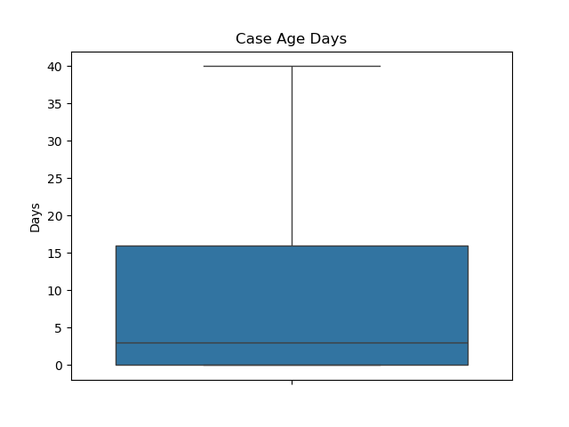</td>
      <td>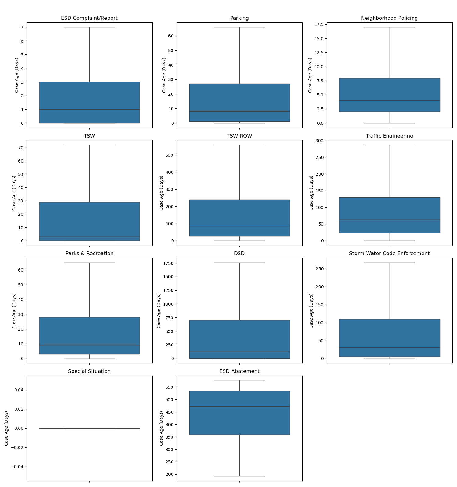</td>
    </tr>
  </table>
  

  </li>

  <li>
    <strong>Linear Regression</strong> — continuous prediction of resolution time

  
<strong>Click here to see Linear Regression analysis images</strong>

  <table>
    <tr>
      <td>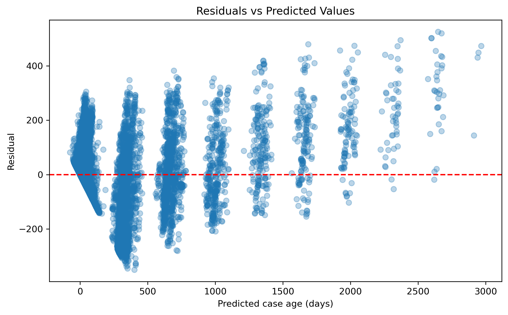</td>
      <td>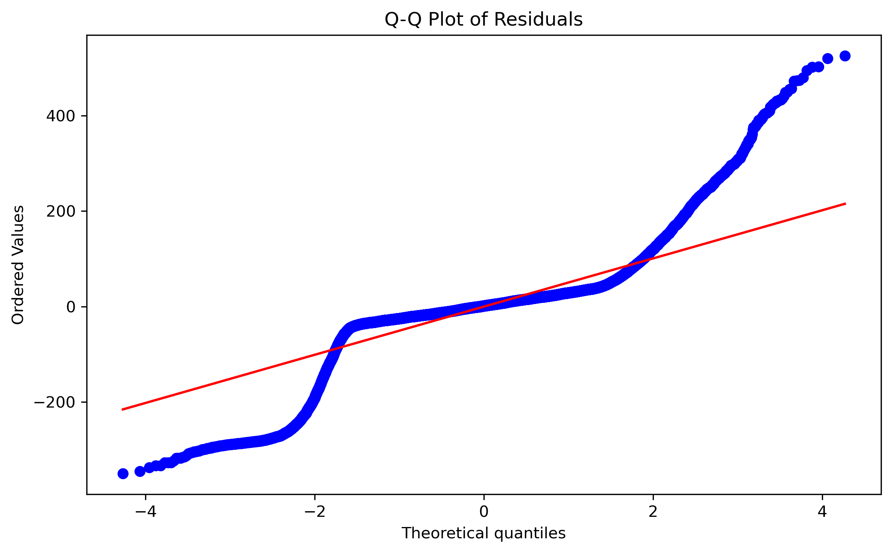</td>
    </tr>
  </table>
  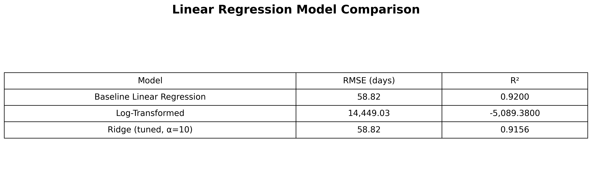
    <table>
    <tr>
      <td>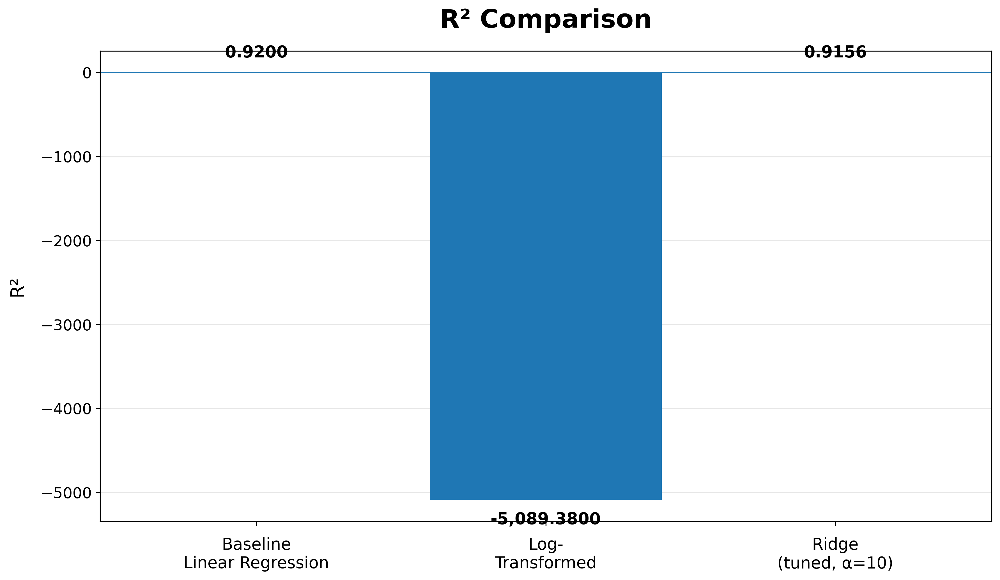</td>
      <td>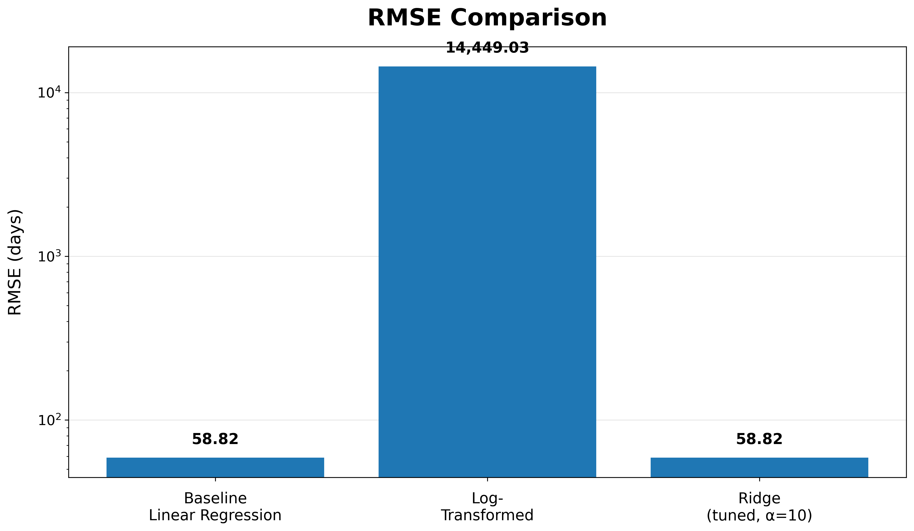</td>
    </tr>
  </table>

  </li>

  <li>
    <strong>Logistic Regression</strong> — classification of 30-day resolution

  
<strong>Click here to see Logistic Regression analysis images</strong>

  <table>
    <tr>
      <td>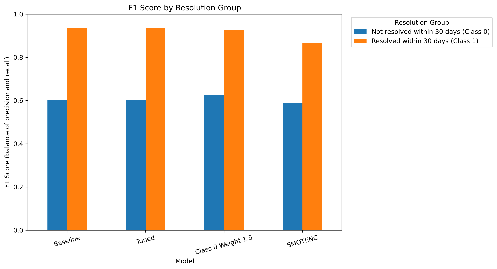</td>
      <td>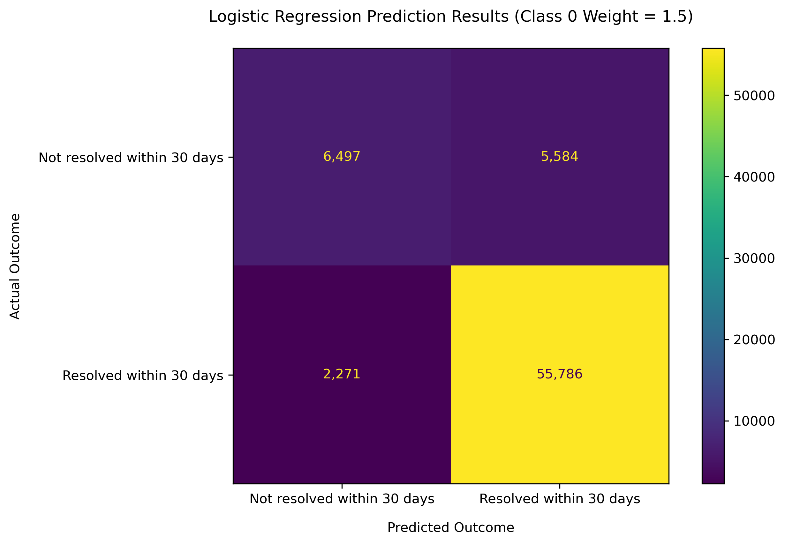</td>
    </tr>
  </table>
  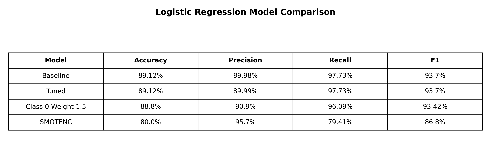
  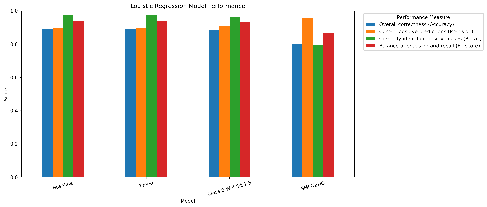

  </li>
  
  <li>
    <strong>K-Means</strong> — unsupervised clustering of service requests

  
<strong>Click here to see K-Means analysis images</strong>

  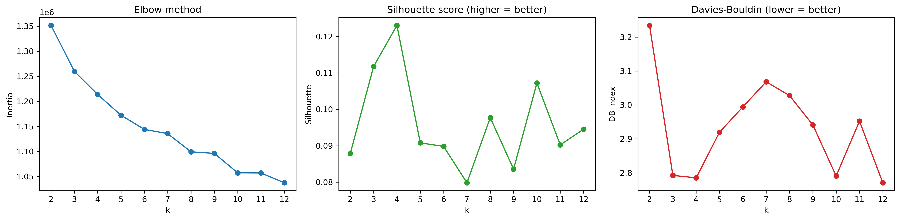
  <table>
    <tr>
      <td>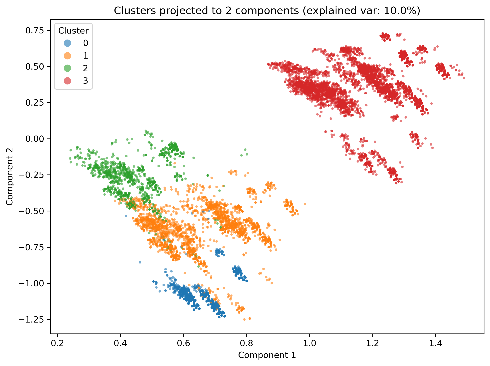</td>
      <td>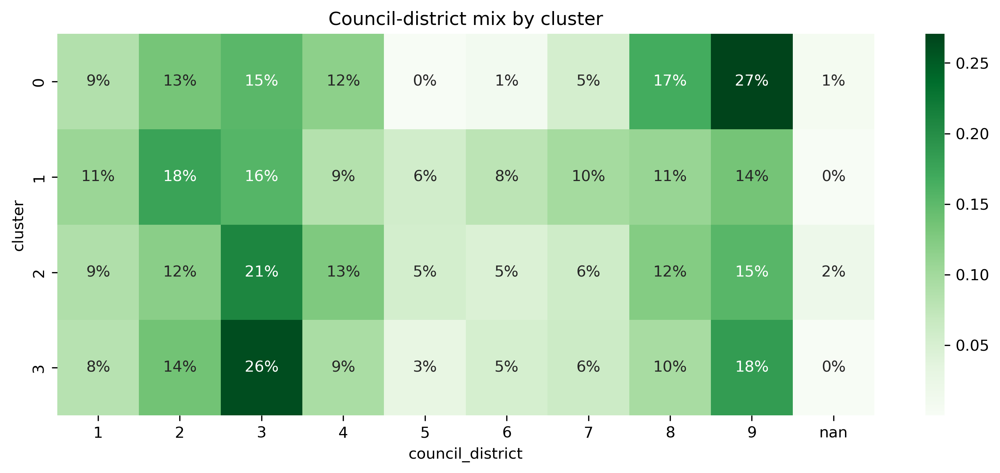</td>
    </tr>
  </table>
  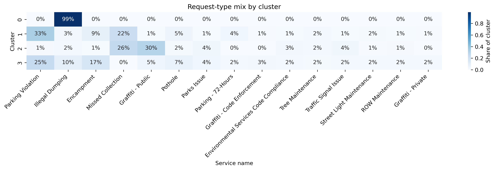
  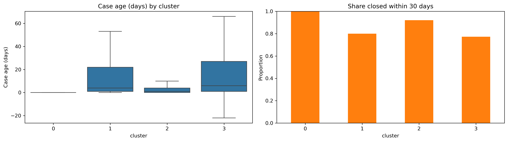

  </li>
</ul>

## Team

Get It Done Crew
San Diego State University
